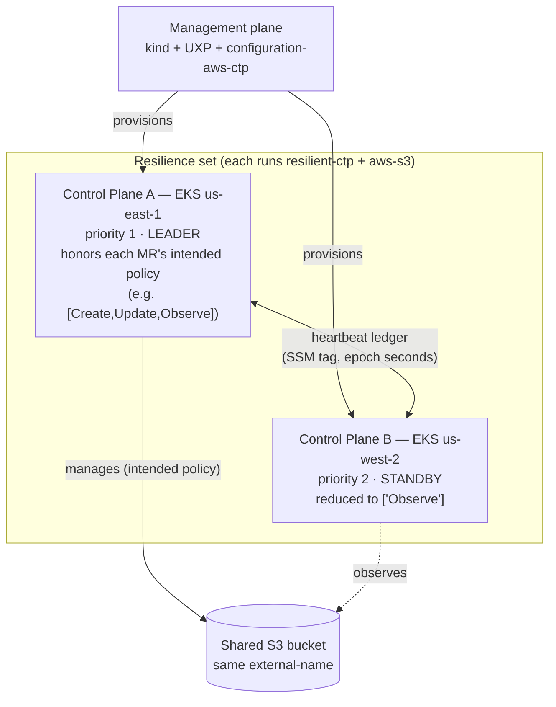
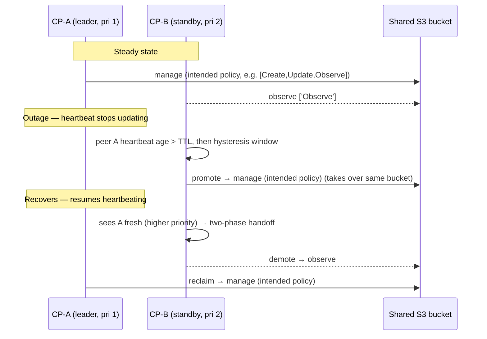

# Architecture & Test 1 topology

> An interactive hand-drawn version is available on Excalidraw:
> https://excalidraw.com/#json=neYLJYL1foN4_Mw4GwxNG,L4z_l6trtnmq-a78qkEa9g
> (open it and use *Export image* to save PNG/SVG into `docs/assets/`).

## Topology (Test 1: 2× AWS)

## Leadership decision (AND rule)

A control plane is the **leader iff**: GSLB-healthy **and** its own heartbeat is
fresh **and** no higher-priority peer is alive (readable + fresh). Any ambiguity
→ treated as **not leader** (never fail open). resilient-ctp decides *leadership*;
the effective write-scope is applied by `function-management-policies`: on the
leader each managed resource keeps its **intended** `managementPolicies`; on
standbys they are reduced to `['Observe']`.

## Failover & failback sequence

See [`SPEC.md`](./SPEC.md) §14 for the validated Test 1 results and operational
learnings (provider observe-poll vs freshness-TTL, `providerConfigRef.kind`,
fail-safe extra-resources fetch).
